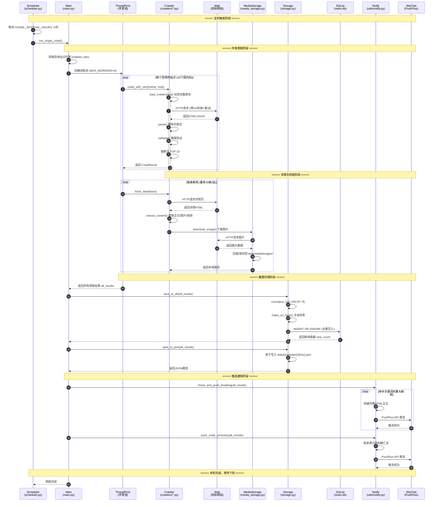
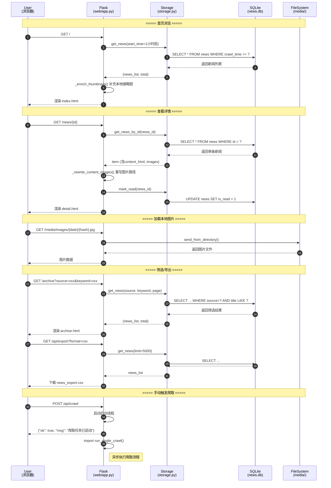
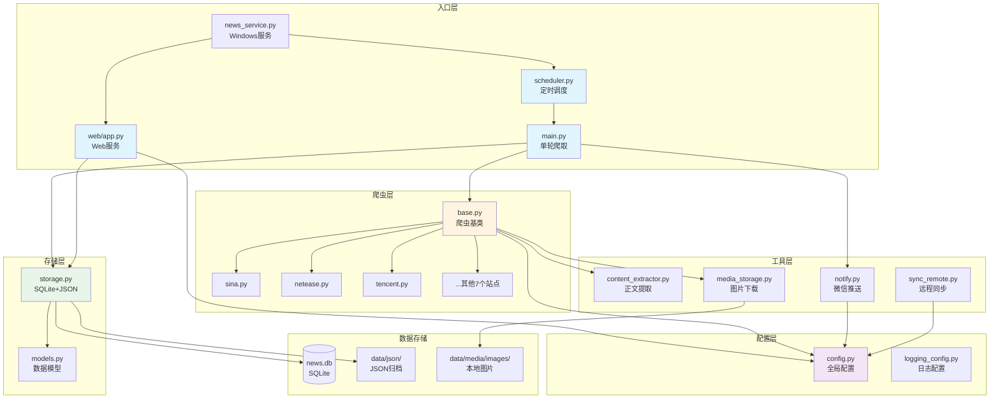

# 新闻爬虫系统 - 完整链路时序图

## 1. 爬取主流程（定时调度 → 数据入库 → 推送通知）



## 2. Web 用户浏览流程



## 3. 模块依赖关系图



## 如何使用

### 方式1: 在 Typora 中查看
直接用 Typora 打开此文件即可渲染

### 方式2: 在 VS Code 中查看
安装扩展: `Markdown Preview Mermaid Support`

### 方式3: 在线查看
1. 打开 https://mermaid.live
2. 粘贴上面 ```mermaid ``` 中的代码
3. 可导出 PNG/SVG/PDF

### 方式4: GitHub
直接在 GitHub 的 Markdown 文件中会自动渲染
