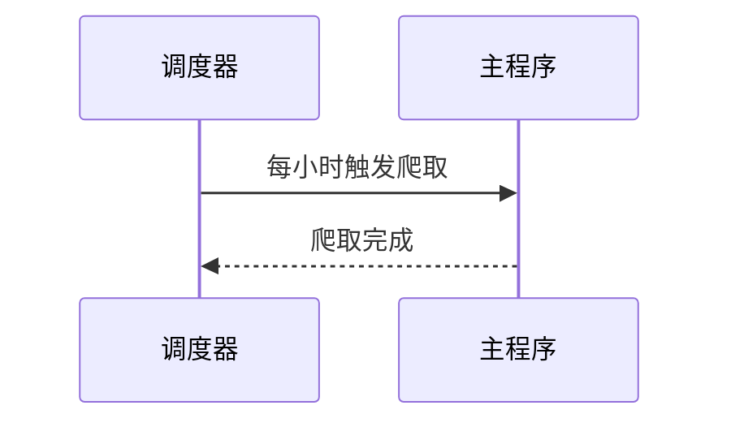
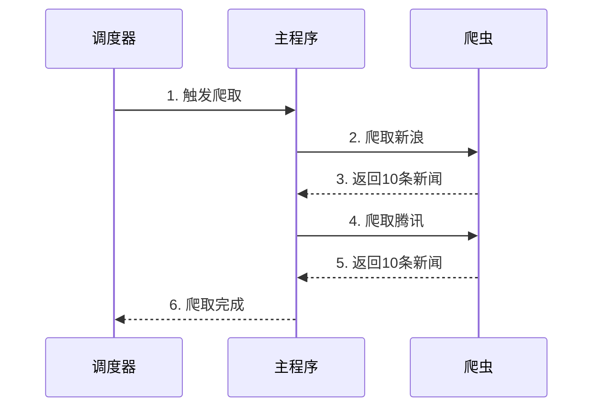
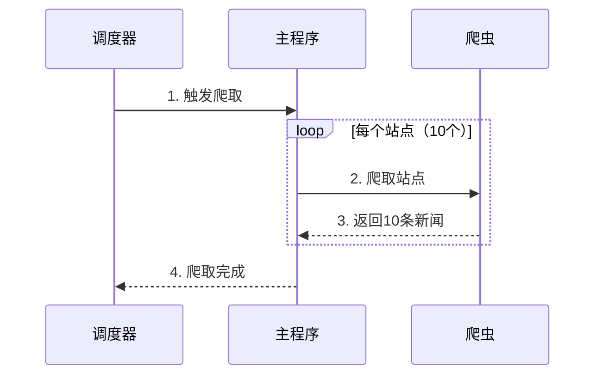
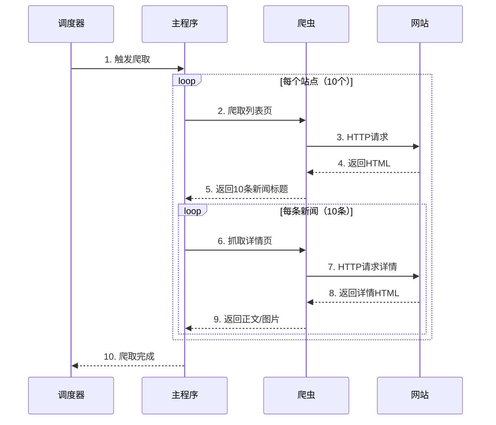
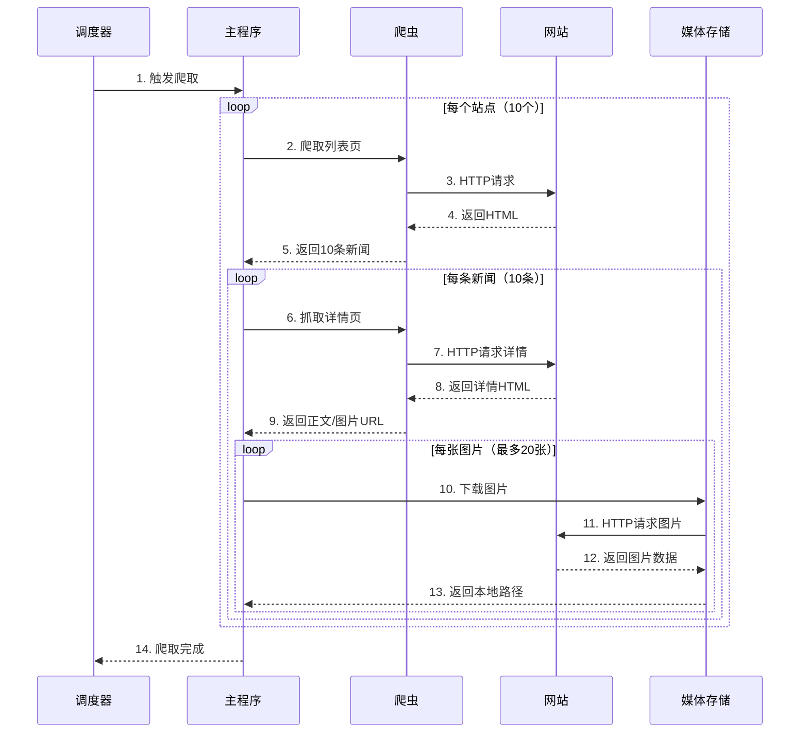
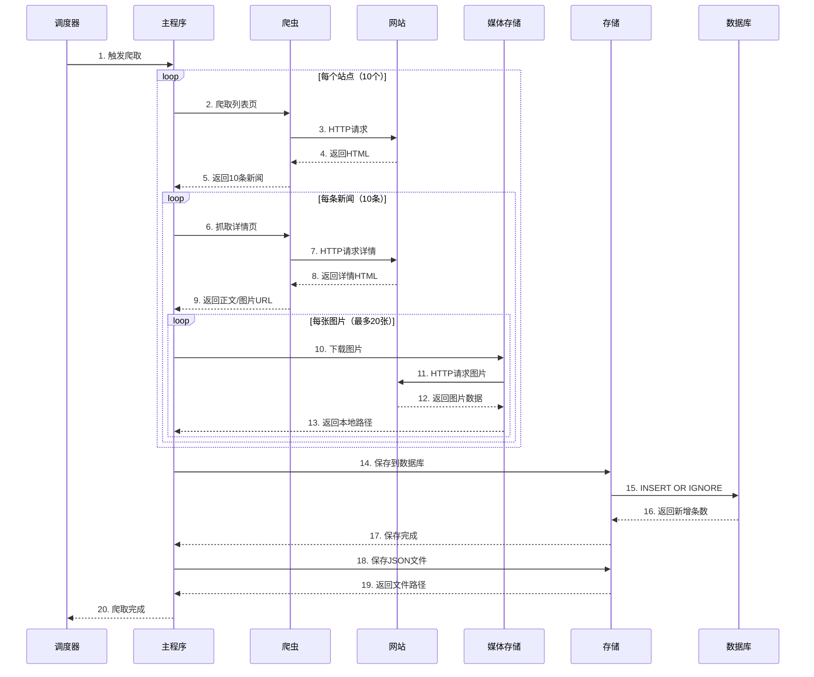
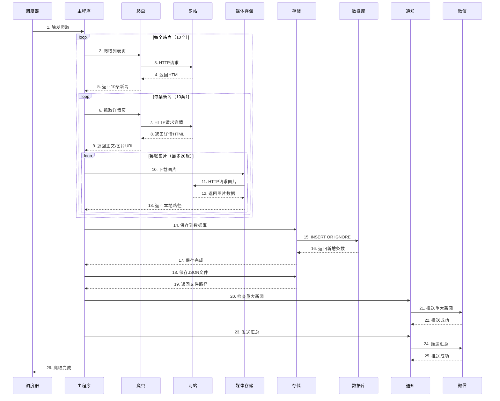

# 新闻爬虫完整时序图 - 学习版

## 第一步：最简单的版本（只有2个参与者）

## 第二步：添加爬虫（3个参与者）

## 第三步：添加并发（用循环表示多个站点）

## 第四步：添加详情页抓取

## 第五步：添加图片下载

## 第六步：添加数据存储

## 第七步：添加微信推送（完整版）

## 学习建议

1. **从第一步开始画**，不要直接画完整版
2. **每画一步就运行**，检查语法是否正确
3. **逐步添加参与者**，理解每个参与者的作用
4. **最后添加细节**（循环、条件、注释）
